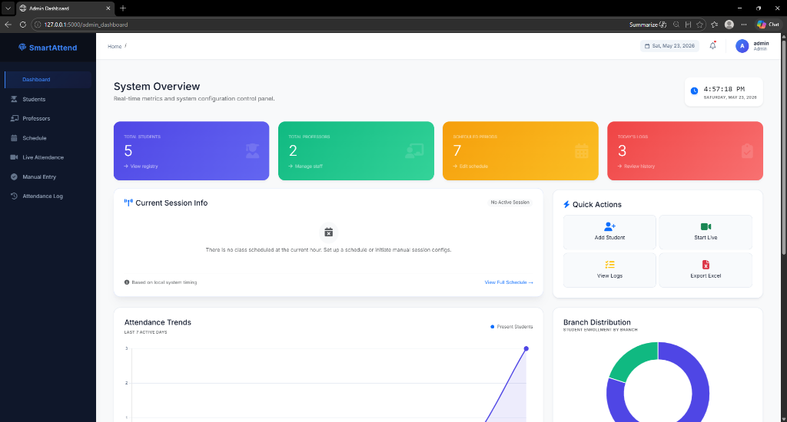
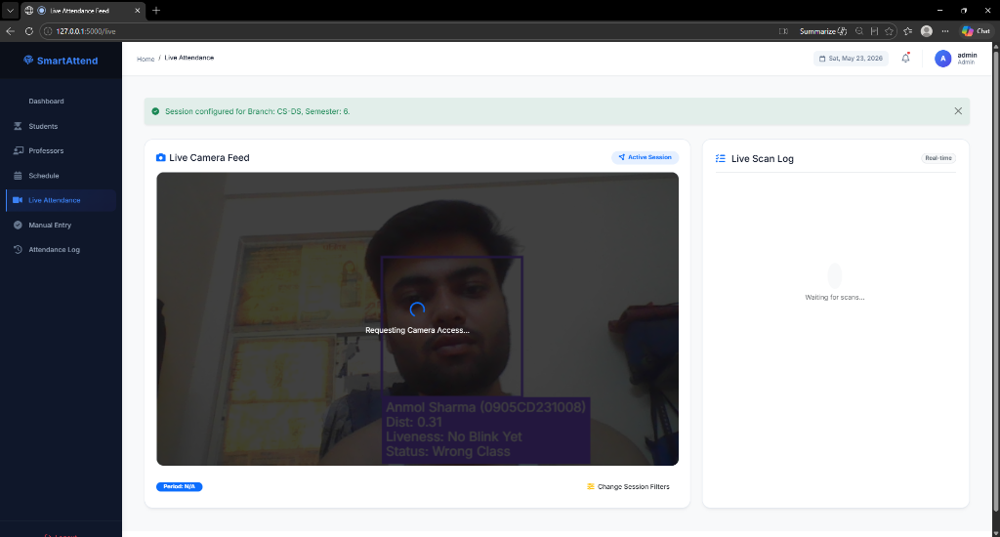
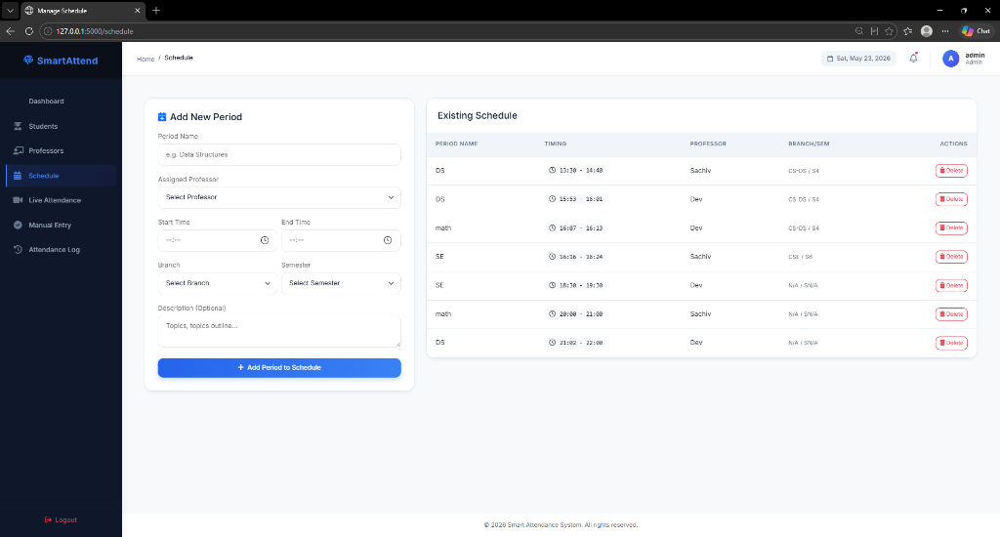
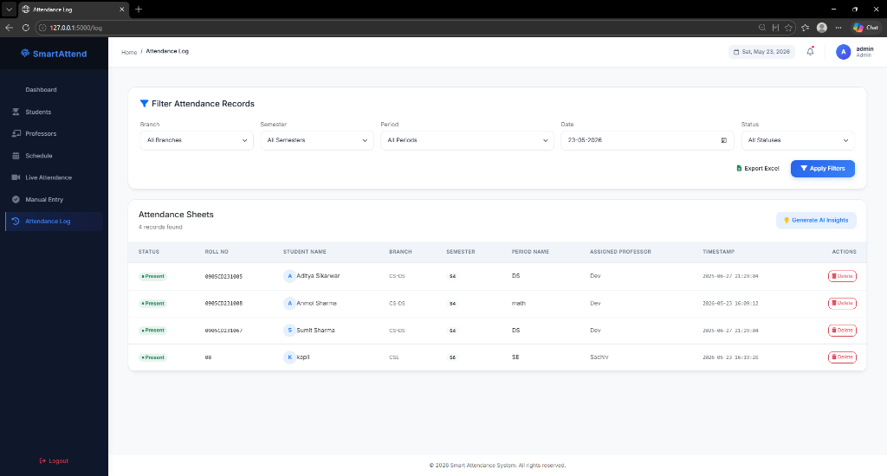
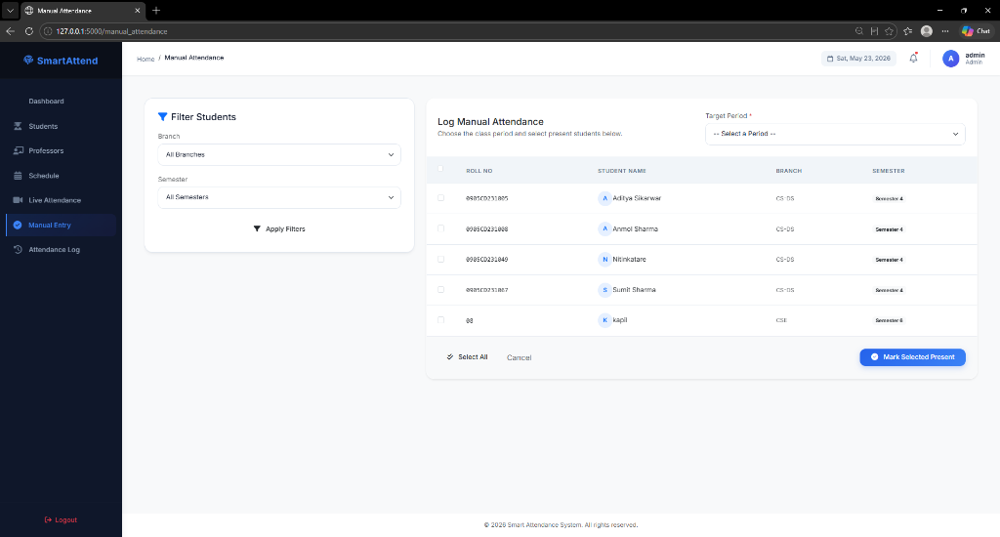

# SmartAttend: Smart Attendance System with Face Recognition & Liveness Detection

SmartAttend is a modern, premium, HR-impressive administration panel designed for academic and corporate environments. Powered by **Flask**, **OpenCV**, **Dlib (face-recognition)**, and **Flask-SocketIO**, the system tracks real-time attendance, detects face liveness using eye-blink analysis, synchronizes credentials directly with SQLite, and generates AI-driven attendance insights.

---

## 🚀 Key Features

*   **Premium SaaS Admin Dashboard**: Custom-styled dark glassmorphic sidebar, topbar widgets (live clock, date badge, profile avatar, dynamic breadcrumbs), and animated statistics cards.
*   **Analytics Charts**: Real-time attendance trends (last 7 days) and branch enrollment counts powered by Chart.js.
*   **Optimized Face Recognition**: Image downscaling checks (4x faster processing) and face-comparison-first architecture to skip redundant calculations.
*   **Anti-Spoofing (Liveness Check)**: Custom Eye Aspect Ratio (EAR) blink detection tracking thresholds on a per-face basis to prevent photo/screen spoofing.
*   **Automatic Database Sync**: Deserializes face-encoding BLOBs directly from SQLite into Flask-SocketIO runtime memory without requiring server restarts.
*   **Manual Entry & Audit Logs**: Split-screen student checklists for manual overrides, customizable schedules, and spreadsheet exports to Excel.
*   **AI Attendance Insights**: Native Bootstrap 5 modal querying local records and generating AI statistics and recommendations.
*   **Modular Blueprint Architecture**: Refactored from a monolithic codebase into clean, self-contained Flask Blueprints.

---

## 📸 Interface Screenshots

### 1. SaaS Admin Dashboard

*A modern, premium admin dashboard showing today's attendance logs, enrollment distributions, active trends, and real-time timers.*

### 2. Live Biometric Recognition & Liveness Tracking

*Real-time webcam scanning with eye-blink tracking, bounding box labels, distance estimation, age/gender classification, and active status indicators.*

### 3. Schedule & Timetable Planner

*Dynamic schedule configuration layout mapping professors, branches, and semesters to specific class slots.*

### 4. Attendance Log History

*A searchable log grid showing student names, classes, timestamps, manual delete forms, and triggers for AI-powered insights.*

### 5. Manual Override logs

*A split-screen student checklist for administrators to record manual attendance overrides.*

---

## 📁 Redesigned Project Structure

```text
├── app/
│   ├── attendance/         # Live webcam streaming, logs, Excel exports, AI insights
│   ├── auth/               # Access decorators, sign-in, and logout routes
│   ├── dashboard/          # Admin/Professor charts, timelines, and action panels
│   ├── professors/         # Faculty directory, edit profile, and credentials
│   ├── students/           # Student registry, photo file uploads, and webcam registrations
│   ├── schedule/           # Timetable scheduler, period creation, and session filters
│   ├── templates/          # Organised Bootstrap 5 HTML layouts
│   │   ├── attendance/
│   │   ├── auth/
│   │   ├── dashboard/
│   │   ├── professors/
│   │   ├── students/
│   │   ├── schedule/
│   │   └── layout.html     # Base structural frame (sidebar + topbar)
│   ├── extensions.py       # Global database connect, pickle caches, and liveness states
│   ├── models.py           # Database tables creation schema
│   ├── face_utils.py       # Face landmarks, EAR calculation, and age/gender wrappers
│   └── __init__.py         # Flask App Factory and SocketIO setup
├── models/                 # Shape predictors, age/gender prototxts and caffemodels
├── static/
│   ├── css/
│   │   ├── dashboard.css   # Keyframe entry, timelines, and glassmorphism styling
│   │   └── style.css       # SaaS palette tokens, table cards, and focus glow inputs
│   └── js/
│       └── dashboard.js    # Chart.js renderers, clock, and count-up loops
├── config.py               # Centralized configuration (thresholds, paths, scaling)
├── requirements.txt        # Frozen Python packages list
├── run.py                  # Standard launcher entry point
└── attendance.db           # SQLite database
```

---

## 🛠️ Technology Stack

*   **Backend**: Flask 3.x, Flask-SocketIO, SQLite3
*   **Frontend**: HTML5, Custom CSS3 variables, Bootstrap 5 (via CDN), FontAwesome 6, Chart.js
*   **Computer Vision / ML**: OpenCV-Python, face-recognition (Dlib engine), MediaPipe, age/gender Caffe models

---

## 📦 Installation & Setup

### 1. Clone & Set Up Directory
Ensure you have Python 3.10+ installed. Open terminal inside the project directory:

```bash
# Create virtual environment
python -m venv venv
venv\Scripts\activate

# Install dependencies
pip install -r requirements.txt
```

### 2. Add Pre-Trained Models
Verify that you place the following files inside the `/models` directory:
*   `shape_predictor_68_face_landmarks.dat` (Dlib shape predictor)
*   `deploy_age.prototxt` & `age_net.caffemodel` (Caffe model for age classification)
*   `deploy_gender.prototxt` & `gender_net.caffemodel` (Caffe model for gender classification)

---

## 🚦 Execution

Run the launch script. The database tables are automatically initialized and synced if missing:

```bash
python run.py
```

Open [http://127.0.0.1:5000](http://127.0.0.1:5000) in your web browser.

### Default Credentials:
*   **Administrator**:
    *   Username: `admin`
    *   Password: `adminpass`
*   **Faculty Member**:
    *   Username: `professor1`
    *   Password: `profpass`

---

## 🔒 Configuration (`config.py`)

Configurable settings are centralized under `config.py`:
*   `TIMEZONE`: Configured timezone (default: `'Asia/Kolkata'`).
*   `EYE_AR_THRESH`: Eye aspect ratio liveness threshold (default: `0.3`).
*   `LIVENESS_SCALE_FACTOR`: Downscaling resolution factor for fast CPU inference (default: `0.25` / 4x speedup).
*   `COOLDOWN_PERIOD`: Wait time in seconds before logging attendance for the same student twice (default: `30`).
