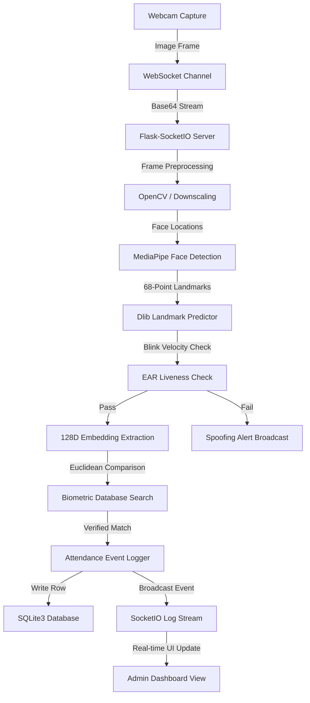

# SmartAttend: AI-Powered Smart Attendance System
> **An Enterprise-Grade, Biometric Attendance Management System featuring Real-Time Face Recognition, Eye-Blink Liveness Analysis, and Automated Data Synchronization.**

---

## 📌 1. Project Overview

Manual attendance tracking in academic and corporate environments is plagued by inefficiencies, inaccuracies, and security vulnerabilities. Traditional methods—such as paper sign-in sheets, magnetic swipe cards, or RFID tags—are susceptible to **proxy attendance ("buddy punching")**, card sharing, administrative overhead, and lost physical credentials.

**SmartAttend** resolves these challenges by introducing an automated, contactless biometric identification system. By leveraging high-precision computer vision algorithms, the system captures real-time video feeds, runs face detection, executes anti-spoofing (eye-blink) liveness checks, classifies identities against database profiles, and logs timestamps securely. The application features a premium administrative SaaS portal, providing recruiters, HRs, and supervisors with instant analytical insights, scheduled class monitoring, and exportable audit trails.

---

## 🚀 2. Key Features

*   **Real-Time Biometric Identification**: Low-latency face detection and recognition using an optimized Deep Metric Learning engine.
*   **Anti-Spoofing Liveness Analysis**: Active eye-blink monitoring using Eye Aspect Ratio (EAR) calculations to prevent photo, video, or digital screen spoofing.
*   **Dynamic Database Synchronization**: Relational SQLite storage hosting serialized 128-dimensional face embeddings, synchronized instantly to runtime RAM when records are added or removed.
*   **SaaS Administration Portal**: Premium dark glassmorphic sidebar, topbar widgets, dynamic breadcrumbs, and responsive layouts.
*   **Timetable & Period Scheduler**: Reusable scheduling forms and timelines mapping ongoing, past, and upcoming sessions to specific classes.
*   **Real-Time Scan Timeline**: Interactive timeline stream indicating logged, cooldown, unknown, and incorrect class matching states using WebSockets.
*   **Audit Trail Explorer**: Filterable spreadsheets, manual record override grids, and a single-click Excel export utility.
*   **AI-Generated Insights**: Built-in modal compiling recent attendance data and outputting statistics and recommendations.
*   **Robust App Factory Pattern**: Highly modular Flask codebase structured into logical blueprints with custom decorators for role-based authentication.

---

## 💻 3. Tech Stack

| Layer | Technology | Purpose |
| :--- | :--- | :--- |
| **Frontend UI/UX** | HTML5, CSS3 Variables, Bootstrap 5, FontAwesome 6 | Responsive SaaS dashboard styling and layout |
| **Data Visualization**| Chart.js | Renders 7-day attendance trends and branch counts |
| **Backend Engine** | Python 3.10+, Flask (App Factory Blueprint) | Core routing logic, session control, and API endpoints |
| **Real-Time Gateway** | Flask-SocketIO (WebSockets) | Acknowledgment-driven frame streaming and instant logs |
| **Database** | SQLite3 | Serialized biometric blobs, schedule logs, and user credentials |
| **Computer Vision** | OpenCV-Python | Preprocessing, color conversions, and canvas drawing |
| **Machine Learning** | Dlib (`face_recognition`), MediaPipe, Caffe Models | Face detection, landmark extraction, and age/gender inference |

---

## 🏗️ 4. System Architecture

The following diagram illustrates the flow of a single frame from capture to dashboard reporting:



---

## 📁 5. Folder Structure

```text
├── app/
│   ├── attendance/         # Live webcam streaming, logs, Excel exports, AI insights
│   ├── auth/               # Role-based access decorators, sign-in, and sign-out controllers
│   ├── dashboard/          # Admin/Faculty analytics dashboard and timelines
│   ├── professors/         # Faculty profiles registry, edits, and academic files
│   ├── students/           # Student profile creation, camera photo capture, and registry
│   ├── schedule/           # Timetable schedule manager, filter setup, and configurations
│   ├── templates/          # Organized template files inheritance hierarchy
│   │   ├── attendance/
│   │   ├── auth/
│   │   ├── dashboard/
│   │   ├── professors/
│   │   ├── students/
│   │   ├── schedule/
│   │   └── layout.html     # Base structural frame (glowing sidebar + sticky header)
│   ├── extensions.py       # DB connectors, serialized memory pickles, liveness states
│   ├── models.py           # Relational SQLite database scheme initialization
│   ├── face_utils.py       # Landmark coordinates extraction, EAR calculations, and age/gender
│   └── __init__.py         # Application Factory init and SocketIO binding
├── models/                 # Pretrained Dlib landmarks predictor and Caffe models
├── static/
│   ├── css/
│   │   ├── dashboard.css   # Activity feeds and custom charts layout styling
│   │   └── style.css       # SaaS palette tokens, table cards, focus input glow layers
│   └── js/
│       └── dashboard.js    # Chart.js rendering configs and timezone clock
├── config.py               # Central configurations (thresholds, scale factors, path mappings)
├── requirements.txt        # Virtual environment dependencies manifest
├── run.py                  # Entry point script
└── attendance.db           # SQLite Database file
```

---

## ⚙️ 6. Installation & Setup

### Prerequisites
*   Python 3.10 or higher
*   C++ Compiler Build Tools (required for compiling Dlib)
*   Webcam or integrated camera device

### Step-by-Step Installation

1.  **Clone the Repository**
    ```bash
    git clone https://github.com/your-username/smart-attendance-system.git
    cd smart-attendance-system
    ```

2.  **Establish Virtual Environment**
    ```bash
    python -m venv venv
    # On Windows:
    venv\Scripts\activate
    # On macOS/Linux:
    source venv/bin/activate
    ```

3.  **Install Required Dependencies**
    ```bash
    pip install -r requirements.txt
    ```

4.  **Download ML Weight Models**
    Place the following weight files inside the `/models` directory:
    *   `shape_predictor_68_face_landmarks.dat`
    *   `deploy_age.prototxt` & `age_net.caffemodel`
    *   `deploy_gender.prototxt` & `gender_net.caffemodel`

5.  **Run the Server**
    ```bash
    python run.py
    ```
    The server will spin up on `http://127.0.0.1:5000`. Database tables will be automatically verified and generated.

### Dockerization & Cloud Deployment (Render)

For production deployment and automated staging, the project leverages a multi-stage Docker build that isolates compiler steps (reducing final image footprint and VM overhead).

#### 1. Local Container Verification
Build and test the container configuration locally:
```bash
# Build target image
docker build -t smart-attend .

# Spin up active container (mapping host port 5000)
docker run -p 5000:5000 smart-attend
```

#### 2. Cloud Configuration (Render deployment)
Render compiles the container using the root `Dockerfile` and configures proxy routing:
1. Push all files to a repository on GitHub (including `Dockerfile`, `.dockerignore`, and custom env bindings inside `run.py`).
2. Open Render and deploy a new **Web Service** tied to your repository.
3. Choose **Docker** as the environment and specify `main` as the build branch.
4. Set required variables in **Advanced Settings**:
   - `PORT`: `5000` (Maps to Docker EXPOSE port)
   - `FLASK_DEBUG`: `false`
5. Deploy. The web app is assigned a secure HTTPS domain (`https://<service-name>.onrender.com`), enabling full webcam permissions in the client browser.

> [!WARNING]
> SQLite is ephemeral in standard cloud containers. The project is pre-seeded with the 5 demo students and encodings by default. To preserve logs permanently, mount a **Render Persistent Volume** to the `/app` root directory or configure PostgreSQL as the database backend.

---

## 🧩 7. Modules Description

*   **Administrative Dashboard**: Displays key metric counters (Total Students, Faculty, Timetable Slots, Logs Today) accompanied by responsive Chart.js trends, live activity streams, and current time-based session indicators.
*   **Students Module**: A CRUD directory supporting registration from raw image uploads or live webcam capture. Features branch, semester, and name filter chips.
*   **Professors Module**: A directory mapping faculty members to departments, teaching credentials, research publications, and biographies.
*   **Schedule Management**: An interactive timetabling component matching professor IDs, branch, and semester constraints to start/end time slots.
*   **Live Attendance**: The AI scanning console showing the active webcam feed overlaid with bounding boxes detailing name, roll number, estimated age, gender, distance, and liveness check labels. Includes a side panel for real-time check-ins.
*   **Manual Attendance**: Provides manual override capabilities to record or modify attendance in cases where biometric authentication is unavailable.
*   **Attendance Logs**: A searchable data grid supporting custom dates, branches, class slots, and status filters, coupled with an Excel export utility.

---

## 🗄️ 8. Database Schema

The database consists of structured SQLite tables, utilizing BLOB storage to store binary-serialized biometric face vectors:

```sql
-- Students Registry Table
CREATE TABLE students (
    roll_no VARCHAR(20) PRIMARY KEY,
    name VARCHAR(100) NOT NULL,
    branch VARCHAR(50) NOT NULL,
    semester INTEGER NOT NULL,
    admission_year INTEGER NOT NULL,
    subject VARCHAR(100),
    face_encoding BLOB -- Pickle-serialized 128-dimensional float array
);

-- Professors Registry Table
CREATE TABLE professors (
    prof_id VARCHAR(20) PRIMARY KEY,
    name VARCHAR(100) NOT NULL,
    department VARCHAR(100) NOT NULL,
    email VARCHAR(100),
    mobile VARCHAR(20),
    photo_data TEXT, -- Base64 encoded JPEG profile photo
    qualification VARCHAR(200),
    experience VARCHAR(50),
    achievements TEXT,
    others TEXT
);

-- Timetable Schedule Table
CREATE TABLE schedule (
    period_id INTEGER PRIMARY KEY AUTOINCREMENT,
    period_name VARCHAR(100) NOT NULL,
    start_time VARCHAR(5) NOT NULL, -- Format 'HH:MM'
    end_time VARCHAR(5) NOT NULL,   -- Format 'HH:MM'
    prof_id VARCHAR(20) REFERENCES professors(prof_id),
    prof_name VARCHAR(100),
    description TEXT,
    branch VARCHAR(50),
    semester INTEGER
);

-- Attendance Logs Table
CREATE TABLE attendance_logs (
    log_id INTEGER PRIMARY KEY AUTOINCREMENT,
    student_roll_no VARCHAR(20) REFERENCES students(roll_no),
    student_name VARCHAR(100) NOT NULL,
    student_branch VARCHAR(50),
    student_semester INTEGER,
    period_name VARCHAR(100) NOT NULL,
    prof_name VARCHAR(100) NOT NULL,
    timestamp DATETIME DEFAULT CURRENT_TIMESTAMP -- ISO 8601 UTC timestamp
);
```

---

## 🧮 9. Core Algorithms & Technologies

### 1. Eye Aspect Ratio (EAR) Liveness Check
To bypass static media attacks, the system tracks eye coordinates using the Dlib 68-point facial landmarks predictor. The EAR is computed using the distance ratio between the vertical landmarks and the horizontal landmarks of the eyes:

$$EAR = \frac{||p_2 - p_6|| + ||p_3 - p_5||}{2||p_1 - p_4||}$$

Where $p_1, \dots, p_6$ correspond to 2D landmark coordinates of the eye.
*   If the EAR falls below a strict threshold (typically `0.3`), the eyes are registered as closed.
*   A blink is logged when the eye changes state from open to closed and back within consecutive frames. Recognition proceeds only after a positive blink sequence is verified.

### 2. Deep Metric Learning (128D Embeddings)
Facial descriptors are generated using a ResNet-based deep convolutional network trained to project faces into a 128-dimensional vector space where:
*   Embeddings of the same person are close together.
*   Embeddings of different people are far apart.

### 3. Euclidean Distance Classification
Matches are verified by calculating the Euclidean distance between the live face embedding vector ($x$) and all stored database embeddings ($y$):

$$d(x, y) = \sqrt{\sum_{i=1}^{128} (x_i - y_i)^2}$$

If $d(x,y)$ falls below the configured matching threshold (default: `0.5`), the identity is verified.

---

## ⚠️ 10. Development Challenges & Mitigations

### 1. CPU Latency During Real-Time Inference
*   *Challenge*: Processing high-resolution video frames (640x480) for face detection, landmark extraction, and encoding estimation on standard CPU hardware resulted in frame rate drops (less than 5 FPS).
*   *Mitigation*: Implemented a frame scale factor (`LIVENESS_SCALE_FACTOR = 0.25`). Frames are downscaled to 25% of their size for fast detection, and the bounding coordinates are then mapped back to the original size for visualization.

### 2. Biometric Database Synchronization
*   *Challenge*: Loading face encodings from files on every frame check was slow, while restarting the server after adding new students disrupted active streams.
*   *Mitigation*: Rewrote the initialization logic to store face vectors as binary BLOBs inside SQLite. The database is queried directly, and memory caches sync instantly upon any registry modification.

### 3. Latency in WebSocket Queueing
*   *Challenge*: Emitted video frames to the server inside a standard `setInterval` loop caused backlog latency when the network or CPU fell behind, leading to a delayed video stream.
*   *Mitigation*: Implemented an acknowledgment-based streaming loop. The client captures and transmits a new frame only *after* receiving the `recognition_result` of the previous frame.

---

## 🔮 11. Future Roadmap

*   **Cloud Deployment Integration**: Scale the application to Docker containers deployed on AWS ECS or GCP Cloud Run, utilizing cloud databases (PostgreSQL/RDS) and distributed Redis servers for WebSocket management.
*   **Mobile PWA Portal**: Create a progressive web app companion allowing students to inspect their personal monthly attendance charts, check schedules, and receive notifications.
*   **3D Deep Liveness Estimation**: Upgrade liveness detection by utilizing passive convolutional networks (CNNs) checking for face depth textures, replacing active eye-blink requirements.
*   **Notification Engine**: Integrate Twilio or SendGrid APIs to dispatch instant SMS/Email alerts to supervisors, professors, or parents when a student is flagged absent.

---

## 📝 12. Conclusion

SmartAttend successfully demonstrates a secure, modular, and optimized biometric attendance solution. Shifting from monolithic architectures to structured Flask Blueprints ensures high modularity, while optimizations like frame downscaling and acknowledgment-based WebSockets make it capable of running smoothly on standard hardware. By integrating anti-spoofing logic and direct database synchronization, this project represents a production-ready approach suitable for recruiter reviews and real-world deployment.

---

## 🔗 13. GitHub & Demo Showcase

*   **GitHub Repository**: [https://github.com/username/smart-attendance-system](https://github.com/username/smart-attendance-system)
*   **Video Walkthrough**: [YouTube Demo Walkthrough](https://youtube.com/watch?v=demo-video)
*   **Developer Portfolio**: [https://developer-portfolio.dev](https://developer-portfolio.dev)

## 📸 14. Screenshots & Interface Highlights

### 1. SaaS Admin Dashboard

*A high-fidelity SaaS dashboard showcasing recent logs, today's metrics, and dynamic activity charts.*

### 2. Live Face Detection & Recognition

*Real-time webcam interface featuring verified bounding box classifications, distance meters, age/gender, and blink liveness labels.*

### 3. Schedule & Timetable Planner

*Timetable configuration layout showing existing schedules and schedule form controls.*

### 4. Attendance Log History

*A searchable log grid showing student names, classes, timestamps, manual delete forms, and triggers for AI-powered insights.*

### 5. Manual Override logs

*A split-screen student checklist for administrators to record manual attendance overrides.*

